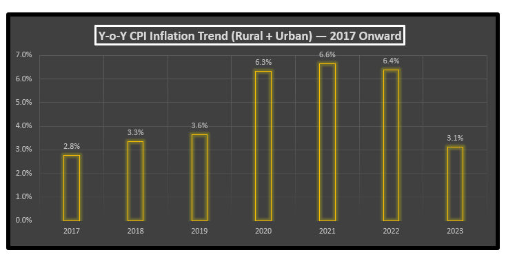
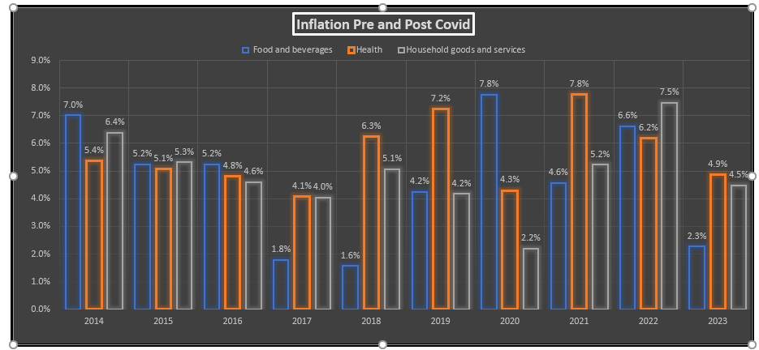

# India CPI Inflation Analysis

**Portfolio Project | Microsoft Excel + Power Query**


---

## 📌 Project Overview

This project analyzes India's Consumer Price Index (CPI) data to identify inflation patterns across consumer sectors and CPI categories.

The analysis was built as an end-to-end Excel + Power Query workflow:

**Raw Data → Data Cleaning → Transformation → Classification → PivotTable Analysis → Visualization → Insights**

The project focuses on five analytical questions covering category-level CPI contribution, year-on-year inflation trends, food-price volatility, COVID-19 effects, and the relationship between fuel-price movements and selected CPI categories.

---

## 🎯 Business Questions

### 01. CPI Category Contribution
Which broader category — Food, Fuel, Housing, Transport, Education, etc. — contributes the most to the overall CPI basket, based on the latest data?

### 02. Year-on-Year CPI Inflation
How has combined (Rural + Urban) CPI inflation moved year-on-year starting from 2017, which year recorded the highest inflation rate, and what real-world reason (based on research) explains why that year spiked?

### 03. Food Basket Volatility
With India's retail inflation hitting a 3-month high of 5.55% in November 2023 — driven largely by food prices — how did the broader food-basket category move month-on-month over the 12 months ending May 2023? Identify the month with the highest and lowest food inflation, the absolute change in inflation over that period, and the single food sub-category that contributed most to it.

### 04. COVID-19 Impact
How did the COVID-19 lockdown (from March 2020) affect inflation in food, healthcare and household essentials, compared with the years before it?

### 05. Fuel-Price Correlation
How closely do imported oil-price movements (2021–2023) track with India's category-wise inflation, and which category correlates most strongly with oil?

---

## 💡 Key Insights

**Insight 1 — Category Contribution**
Food is the single largest contributor to the CPI basket (~44%), followed by Luxury items (~15%) and Clothing (~11%). Categories like Education, Health, and Fuel & Light each contribute a much smaller share individually.

**Insight 2 — Year-on-Year Inflation**
Combined Rural + Urban CPI has risen every year from 2016 to 2023. Inflation accelerated sharply from 2020 onward, with **2021 recording the highest year-on-year increase (~6.65%)**, closely followed by 2022 (~6.39%) and 2020 (~6.32%) — reflecting the compounding effects of pandemic-driven supply disruptions, followed by demand recovery and global commodity price spikes.

**Insight 3 — Food Basket Trends**
Sub-category tracking (Milk & products, Fruits, Vegetables, Pulses) shows vegetables as the most volatile food group month-to-month, with sharp swings driven by seasonal supply, while milk and pulses trend more steadily upward across the period.

**Insight 4 — COVID-19 Effect**
The 2020 lockdown year saw Food & Beverages inflation jump to ~7.8% (up from ~4.2% in 2019) as supply chains were disrupted and demand for essentials stayed high. Interestingly, Health inflation *slowed* that year (from ~7.2% in 2019 to ~4.3% in 2020), while Household goods & services growth also cooled, suggesting spending shifted heavily toward food during the lockdown.

**Insight 5 — Fuel vs. Transport Correlation**
Fuel & Light and Transport & Communication indices show a moderately strong positive correlation (**r ≈ 0.67**) over 2021–2023, confirming that rising fuel costs consistently pass through into transport-related inflation.

---

## 🛠️ Tools & Techniques
- **Microsoft Excel** — PivotTables, PivotCharts, formulas for YoY % change and correlation
- **Power Query** — data cleaning, unpivoting, and transformation of raw CPI data
- **Data Visualization** — dashboard summarizing all five insights

---

## 🔄 Project Workflow

```
                    RAW CPI DATA
                         |
                         ▼
                 POWER QUERY EDITOR
                         |
              ┌──────────┴──────────┐
              |                     |
         Data Cleaning      Data Transformation
              |                     |
              └──────────┬──────────┘
                         ▼
                  CPI UNPIVOT DATA
                         |
                         ▼
                BROADER CLASSIFICATION
                         |
                         ▼
                    PIVOTTABLES
                         |
                         ▼
                ANALYSIS & CALCULATIONS
                         |
                         ▼
                   VISUALIZATIONS
                         |
                         ▼
                    KEY INSIGHTS
```

---

## 📊 Analysis & Visualizations

### 01. Broader Category Contribution
**Question:** Which broader category has the highest contribution towards the CPI calculation?


Food is the largest contributor to the CPI basket (~44%), followed by Luxury items (~15%) and Clothing (~11%).

---

### 02. Year-on-Year CPI Inflation
**Question:** How has combined (Rural + Urban) CPI inflation moved year-on-year starting from 2017, which year recorded the highest inflation rate, and why?



Rural + Urban CPI rose every year from 2016–2023, with 2021 recording the sharpest YoY jump (~6.65%), closely followed by 2020 and 2022 — reflecting pandemic-driven supply disruptions and the post-COVID demand recovery.

---

### 03. Food Basket Volatility
**Question:** How did the broader food-basket category move month-on-month over the 12 months ending May 2023, and which sub-category contributed most?


Vegetables emerged as the most volatile food sub-category month-to-month, driven by seasonal supply swings.

---

### 04. COVID-19 Impact
**Question:** How did the COVID-19 lockdown (from March 2020) affect inflation in food, healthcare and household essentials, compared with the years before it?



Food & Beverages inflation spiked to ~7.8% in 2020 (up from ~4.2% in 2019), while Health inflation actually slowed, suggesting spending shifted heavily toward food during lockdown.

---

### 05. Fuel-Price Correlation
**Question:** How closely do imported oil-price movements (2021–2023) track with India's category-wise inflation, and which category correlates most strongly?


Fuel & Light and Transport & Communication show a moderately strong positive correlation (r ≈ 0.67), confirming fuel-cost pass-through into transport inflation.

---

## 📂 Repository Structure
```
├── CPI_Inflation_Analysis.xlsx   # Full workbook (raw data, queries, pivots, dashboard)
├── images/                        # Dashboard & insight screenshots
└── README.md
```

## 📊 Data Source
All India Consumer Price Index data (Rural, Urban, Combined) — Ministry of Statistics and Programme Implementation (MoSPI), Government of India.

---

*This project was built as part of a data analytics learning path to practice real-world Excel + Power Query workflows on public economic data.*
